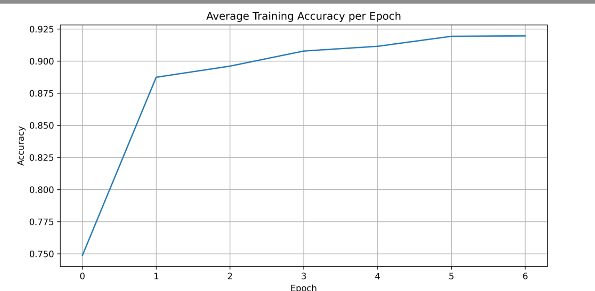

# 使用Transformer基于ember数据集的训练

This paper describes many more details about the dataset: https://arxiv.org/abs/1804.04637

## Transformer模型效果

### 第一次训练：12维输入

### 第二次训练 524维输入，加入直方图和字节熵

恶意样本

善意样本

### 第三次训练 524维特征进行归一化（存在问题）

## 融合模型

malicious if ember > 0.5 or Transformer == malware

